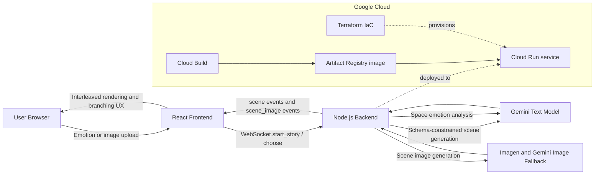

# Architecture Diagram

## System diagram (Mermaid)

## Request lifecycle

1. User chooses emotion or uploads a room image.
2. Frontend sends `start_story` over WebSocket with selected `output_mode`.
3. Backend optionally analyzes image mood using Gemini.
4. Backend generates structured scenes using Gemini with JSON schema constraints.
5. Backend emits scene text blocks immediately, then pushes generated image when ready.
6. User selects a branch choice.
7. Frontend sends `choose`, backend continues story statefully until final scene.

## Component responsibilities

- Frontend (`client/`)
  - Collects multimodal input.
  - Lets user select narrative mode: Judge English, Arabic Fusha, Egyptian colloquial.
  - Renders interleaved blocks (`narration`, `visual`, `reflection`) and scene progress.
  - Handles reconnect/status UX.
- Backend (`server/`)
  - Maintains story state per WebSocket connection.
  - Builds mode-specific prompts and UI status strings.
  - Generates scenes with Gemini and validates/normalizes output.
  - Generates scene images asynchronously and streams updates.
- AI services (`server/services/`)
  - `gemini.js`: structured text generation + image-based space analysis.
  - `imagen.js`: image generation with model fallback strategy.
- Cloud and deployment
  - Cloud Run: backend hosting.
  - Cloud Build: image build/deploy.
  - Terraform: reproducible infrastructure provisioning.

## Grounding and reliability choices

- Structured output schema reduces malformed scene responses.
- Output mode normalization prevents unsupported language mode values.
- Model fallback strategy handles deprecated or unavailable model names.
- Health endpoint (`/health`) and scripted deploy reduce judging risk.

## Code traceability map

- WebSocket orchestration: `server/index.js`
- Prompting and output modes: `server/prompts/storyteller.js`
- Gemini structured generation: `server/services/gemini.js`
- Image generation fallback: `server/services/imagen.js`
- Frontend live rendering: `client/src/components/SceneRenderer.jsx`
- Narrative mode UX: `client/src/components/EmotionPicker.jsx`

## Export PNG for Devpost upload

1. Copy contents of `docs/ARCHITECTURE_DIAGRAM.mmd`.
2. Paste into https://mermaid.live.
3. Export as PNG and upload to Devpost architecture section.
