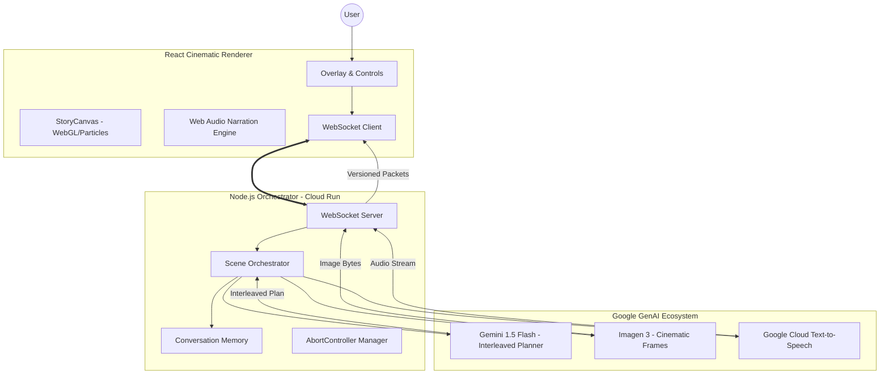

# Maraya Storyteller — System Architecture

Maraya is a live, agentic cinematic storyteller built for the Google Gemini API Developer Competition. It transitions from traditional turn-based AI to a continuous, interleaved media stream.

## High-Level Architecture

## Key Architectural Decisions

### 1. Interleaved Planning
Instead of generating plain text, Gemini 1.5 Flash is prompted to act as a **Creative Director**. It outputs a structured JSON timeline containing narration segments, image prompts, and musical mood shifts. This allows the backend to stream media components as they become ready, providing a seamless "interleaved" experience.

### 2. Surgical Live Redirection
Maraya supports mid-stream narrative pivots. When a user changes the mood (e.g., to "Nightmare"), the system:
1.  **Aborts** all in-flight AI generations using `AbortController`.
2.  **Clears** the client-side playback queues.
3.  **Increments** a `sceneVersion` counter to ensure any late-arriving packets from previous generations are discarded.
4.  **Re-plans** the story trajectory starting from the current scene index, maintaining continuity while forcing a hard stylistic pivot.

### 3. Versioned Media Gating
To guarantee stability during rapid redirection, every WebSocket packet (text, audio chunk, image) is tagged with a `v` (version) property. The frontend maintains a `lastAcceptedVersion` state and silently drops any media that belongs to an aborted trajectory.

### 4. Cinematic Image Fallback
To solve the inherent latency of high-quality image generation (Imagen 3), the frontend implements a **900ms Pacing Guard**. If a new frame isn't ready when the narration starts, the system applies a "Grade Shift" (Overlay + Blur) to the previous frame and displays a technical status message, ensuring the audio and narrative flow never stop.

## Technology Stack
*   **Runtime:** Node.js / Express
*   **Frontend:** React / Vite / Canvas API
*   **Intelligence:** Gemini 1.5 Flash
*   **Visuals:** Imagen 3 (imagen-3.0-generate-002)
*   **Voice:** Google Cloud Text-to-Speech
*   **Deployment:** Google Cloud Run / Docker
